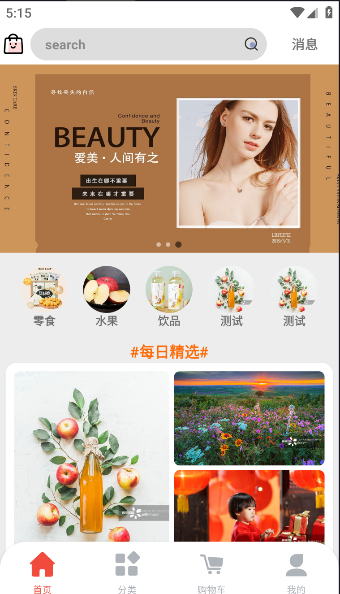
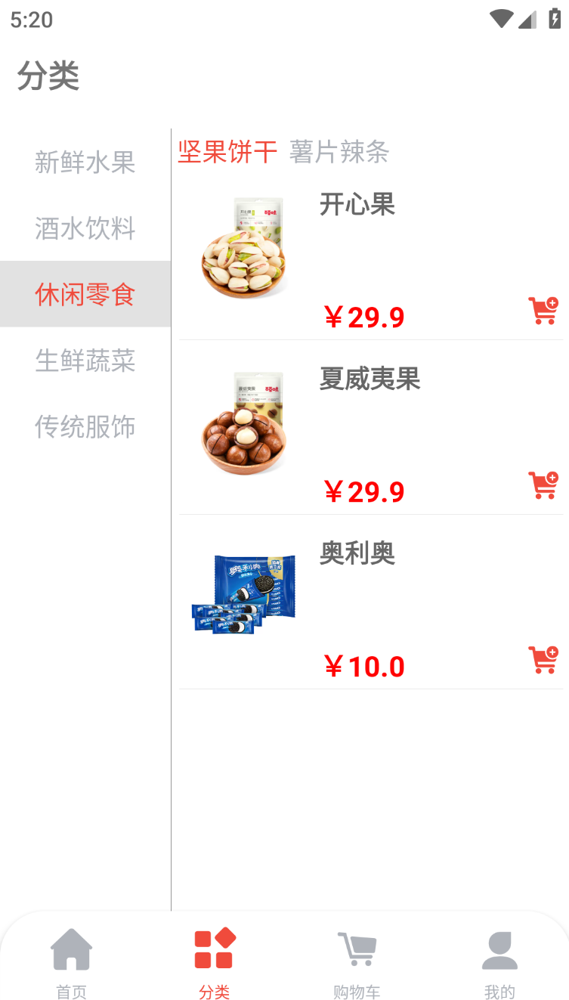
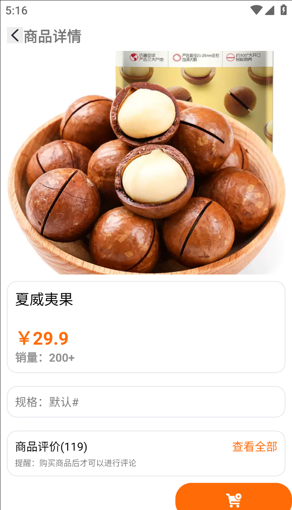
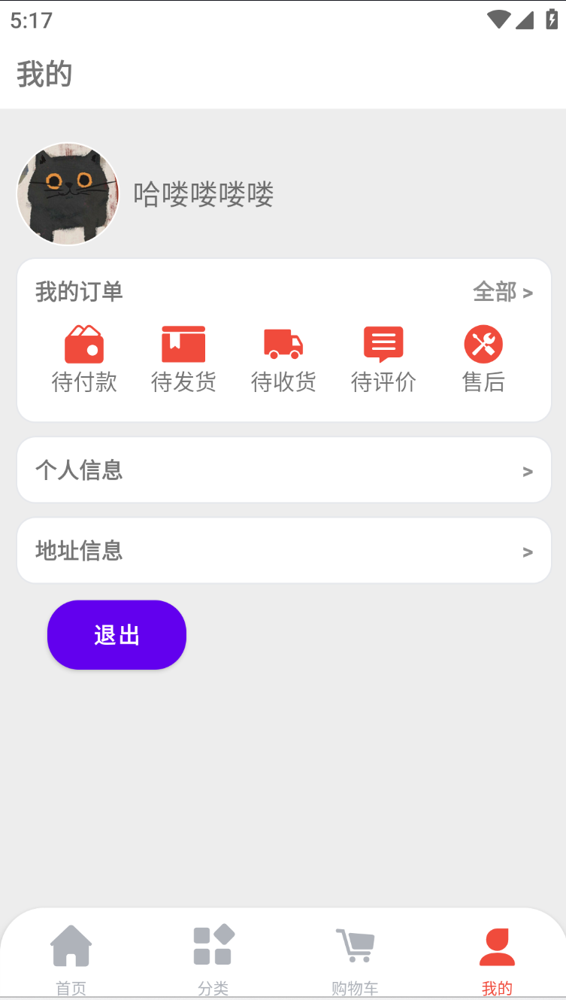
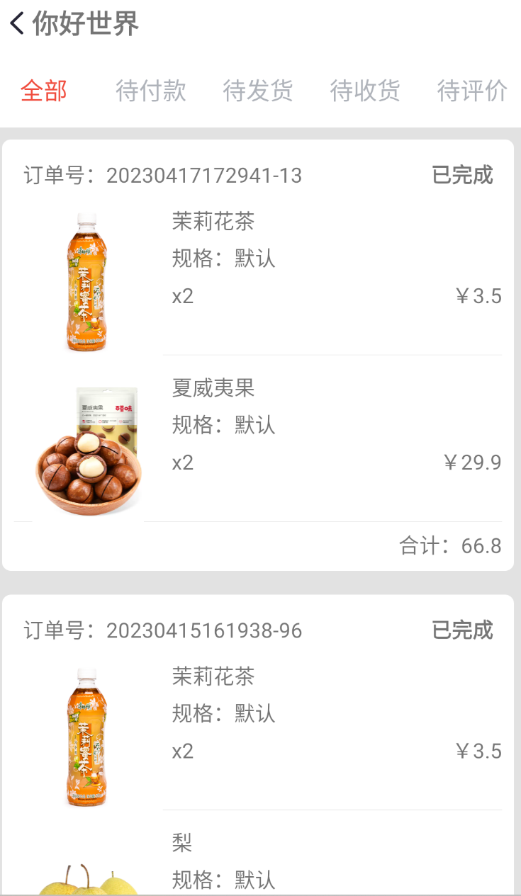
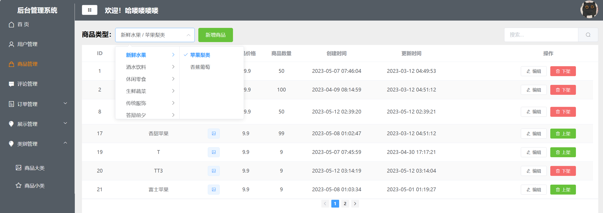

# 🛒 Android-Mall 商城项目

**技术架构**：Android + SpringBoot + Vue

## 📱 应用展示

### Android 客户端

  
   
  
  
  

### Vue 管理后台

  

## ✨ 核心功能

- 🔐 **用户系统** — 支持注册登录、个人信息管理  
- 🛍️ **商品模块** — 商品展示、分类筛选、详情查看
- 🛒 **购物流程** — 购物车管理、订单管理  
- 💳 **支付集成** — 接入支付宝沙箱模拟支付  
- 📊 **后台管理** — 基于 Vue 的管理端，实现商品、订单、用户的统一管理  

## 🛠 技术栈

### 📲 客户端：Android
- 原生 Android 开发（Java）

### ⚙️ 后端：SpringBoot
- SpringBoot 构建 RESTful API
- MyBatis 数据持久层
- MySQL 数据库存储
- Maven 项目构建与依赖管理

### 🖥️ 管理端：Vue
- Vue 前端框架
- Element Plus 组件库
